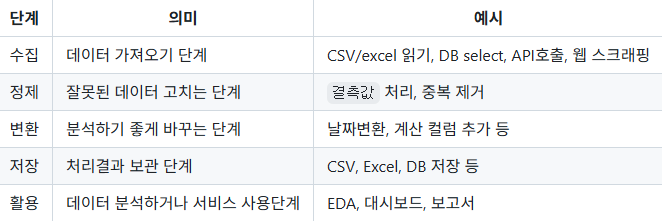

AI에이전틱 개발자 데이터 파이프라인 과목

## 개요

- 데이터 파이프라인 -`도메인`에 필요한 데이터를 수집, 정제 변환, 저장 분석 시스템으로 전달하는 일련의 자동화된 처리과정
- 예전에는 전문가가 수동으로 하나씩 작업
- 현재는 자동화 시스템 구축해서 사용가능

원천 데이터가 목적지에 도달, 활용 전까지 수집, 처리, 전달을 자동화하는 시스템

쇼핑몰 매출 데이터 분석 예

1. 주문 데이터 발생
2. 주문 데이터를 CSV나 Excel,DB에서 가져옴
3. 잘못된 값, 누락된 값, 중복 데이터 등을 정리
4. 상품별 매출, 일별 매출 계산
5. 정리된 데이터로 파일, DB에 저장
6. 저장된 데이터를 분석, 시각화
7. 머신/딥러닝 통해서 미래 예측

### 학습 기술스택

1. `Numpy` - 배열을 쉽게 사용하도록 만든 패키지
2. `Pandas` - 표 형태로 데이터를 가공할 때 필요한 패키지
3. `Matplotlib` - 시각화(차트)용 패키지
4. `Seaborn` - Matplotlib을 미려하게 변경해주는 패키지
5. `Selenimum` - 자동으로 데이터를 수집하는 패키지
6. Folium - 지도를 시각화 패키지
7. BeutifulSoup - 정적으로 데이터를 수집하는 패키지

### 기술스택 기초 학습

#### Numpy

- 파이썬에서 숫자 데이터를 빠르게 처리하기 위한 대표적인 라이브러리(패키지) Pandas, selenium 등으로 연결
- [보기](./Chapt%2001/넘파이기초.ipynb)

### Pandas

- 표 형태의 데이터를 손쉽게 다루기 위한 파이썬 라이브러리 (패키지)
- Numpy가 숫자 배열을 처리, pandas는 행과 열로 실제 데이터셋 읽고 ,DB 처럼 선택, 요약 수정하는 도구
- [판다스 기초](./Chapt%2001/판다스기초%20chapt01.ipynb)
- [판다스 정제](./chapt%2002/판다스데이터처리.ipynb)
- [판다스 집계](./chapt%2002/판다스집계.ipynb)

### Visualization - Matplotlib, Seaborn

- Pandas, Numpy로 정제한/ 정제된 데이터를 시각화하는 라이브러리 (패키지)
- EDA(Exploratory Data Analysis) : 탐색적 데이터 분석 시 사용
- - 항목별 크기비교 : 막대 그래프
  - 시간에 따른 변화 : 선 그래프
  - 숫자 데이터 분포 : 히스토그램
  - 두 숫자 데이터  관계 : 산점도
  - 이상치 확인 : 박스플롯
- [시각화 기초](./chapt%2003/시각화기초.ipynb)

### Selenium

- 웹 페이지에서 필요한 데이터를 수집해오는 자동화 라이브러리(패키지)
- 데이터 수집: Open API 사용, 스크래핑
- 기본적으로 `HTML','CSS',' JS`

- [HTML 구조 노트북](./chapt%2004/웹구조.ipynb)
- [HTML 예제](./chapt%2004/index.html)

